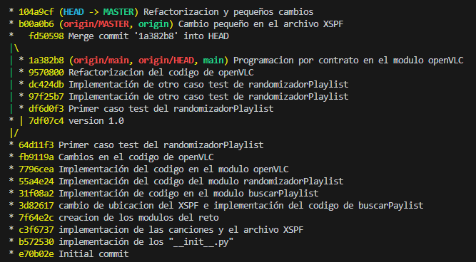
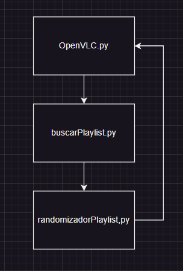
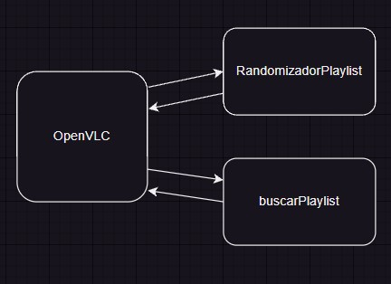
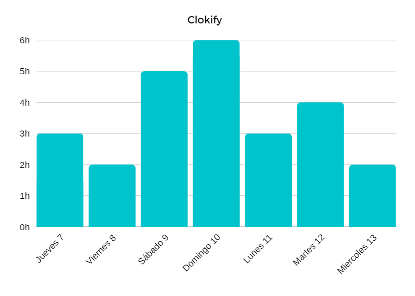

# RetoDiciembreVLC

### Índice

- Intoducción
- Manual de usos
    - Pre-requisitos
    - Instalación
    - Uso
- Metodología
    - Uso de Git
- Descripción técnica
    - Arquitectura de la aplicación
    - Diagrama de Uso
- Implementación
    - Tecnologías y Herramientas elegidas
- Coverage
- Clokify
- Conclusión
- Posibles Mejoras


## Introducción

Este es un proyecto propuesto por nuestro profesor de programacion David Gelpi [@Dfleta](https://github.com/Dfleta) de 1º de DAM en el instituto IES de teis.

RetoDiciembreVLC es un proyecto Python que fusiona VLC con listas de reproducción. Sus módulos permiten buscar y manipular listas, implementando funcionalidades para randomizar y abrir listas de reproducción. Este proyecto proporciona una solución integral para gestionar y disfrutar de contenido multimedia de manera versátil. Desde la búsqueda y manipulación de listas hasta la reproducción aleatoria, ofrece una experiencia mejorada de VLC. Explora la integración sencilla y eficaz de VLC con Python para enriquecer tus opciones de reproducción de medios en un entorno de desarrollo amigable.

Como ya mencione antes usaremos como lenguaje de programación Python (versión 3.11.5).

## Manual de uso

### Pre-requisitos

- Python3
- Pip3
- Git
- Coverage
- VSCode (o cualquier interprete)
- VLC

### Instalación

#### Instalar Python.

Podremos instalar Python desde su [pagina oficial](https://www.python.org/downloads/). Importante añadir el PATH durante la instalación.

#### Buscamos una carpeta para clonar el directorio.

Para esto buscamos la tura donde queremos crear el directorio:

```bash
$ cd <ruta donde se quiera crear el directorio >
```

De seguido creamos el directorio:

```bash
$ mkdir <Nombre del directorio >
```

Hacemos un git clone del proyecto en GitHub:

```bash
$ git clone https://github.com/JPRojasVas/RetoDiciembreVLC.git
```

Y instalamos las dependencias:

```bash
$ pip install -r requirements.txt
```

### Uso

Esa aplicacion se puede abrir desde el modulo `openVLC.py`, una vez ejecutado la aplicación debemos colocar la ruta de la playlist que queremos implementar para que el programa cree una lista con las url de las canciones, esto se hace un el modulo `buscarPlaylist.py`. Una vez tengamos la playlist se ejecutara el modulo `randomizadorPlaylist.py` el cual randomiza la playlist que le enviamos, por ultimo se ejecuta el modulo `openVLC.py`, el cual busca la ruta del `vlc.exe` en `Archivos de programa` ejecuta la aplicación con la playlist randomizada, la cual se empieza a reproducir.

## Metodología

### Uso de Git

En este proyecto se encuentran se encuentran dos ramas, la rama `main` y la rama `MASTER`, esta ultima tendria la funcionalidad de la rama `develop`.

A continuacion una imagen desde la teminal:



## Descripción técnica

### Arquitectura de la aplicación



### Diagrama de Uso



## Implementación

### Tecnologías y Herramientas elegidas

- Python:

    `xml.etree.ElementTree`

    `os`

    `random`

    `subprocess`

    `pytest`

    `coverage`

    `pip`

- Git

## Coverage

```
Name                          Stmts   Miss  Cover
-------------------------------------------------
src\randomizadorPlaylist.py       4      0   100%
test\test_randomizador.py        16      0   100%
-------------------------------------------------
TOTAL                            20      0   100%
```

## Clokify

El tiempo estimado que me llevo hacer este proyecto se estima entre las `26 horas`



## Conclusión

Este a sido un proyecto en el cual empezar a hacerlo me resulto en un problema que me costo reslover, pero una ver salí de ese problema lo tome con mas fluides y aunque hubo algunos problemas el progama logro funconar.

La programacion modular fue bastante útil a la hora de tener que ejecutar el programa lo cual resolvio muchos problemas encontrados anteriormente.

El dilema de sacar los datos del archivo `.xspf` fue un reto duro de superar, pero gracias al entendimiento de `xml.etree.ElementTree` se logra de una manera mas sencilla de lo que parece, lo cual deja con buen sabor de boca a cualquier programador.

## Posibles Mejoras

- Aumento de los casos test

- Refactorización en el codigo (nombres de variables, simplificación,...)

- Uso de Markers

- Un modulo app.py para un uso mas sencillo del programa